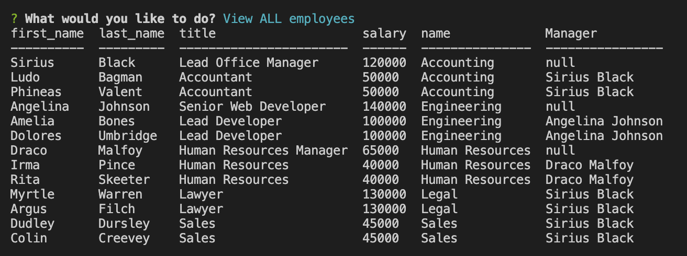
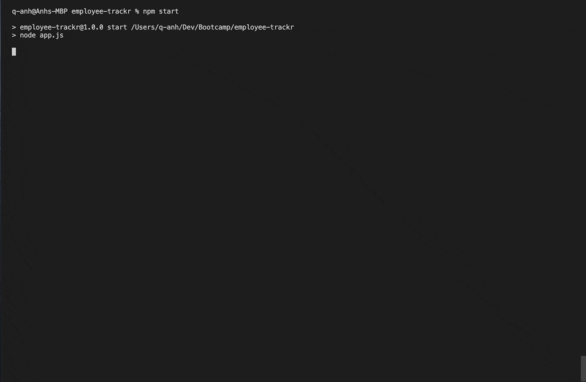

# Employee Tracker
### Description 
Employee tracker is an CLI application used to access employee database. This application allows user to view, add, update and delete employees from the database. 

### Installation 
1. Go to root directory and run `npm install` in order to use all dependencies
2. SOURCE db files in order to create a sample database
3. Run `npm start` in terminal and go through the options

### Screenshot of database 

### Usage and demo

### Technologies
* [MySQL2](https://www.npmjs.com/package/mysql2)
* [Node.js](https://nodejs.org/en/)
* [inquirer](https://www.npmjs.com/package/inquirer)
* [console.table](https://www.npmjs.com/package/console.table)

